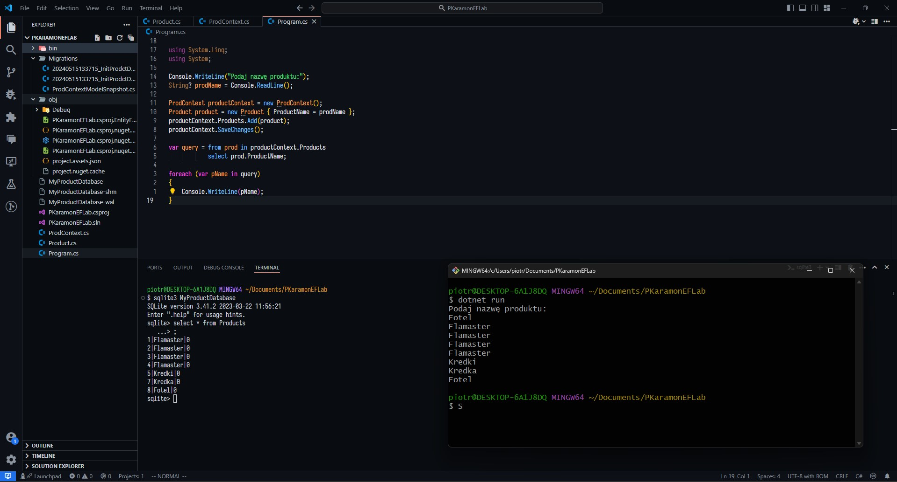
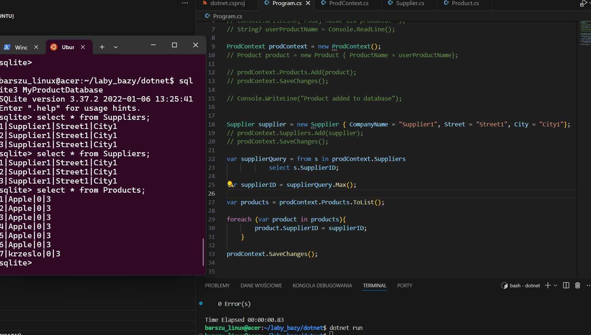

# Entity framework - raport

W zespole:

- Bartłomiej Szubiak,
- Szymon Kubiczek,
- Konrad Armatys

## _Część I_



## _Część II_

Udało Nam się zrobić do punktu a.ii.



```c#
//dodanie tylko dla ostatniego produktu
var lastProduct = products.Last();
lastProduct.SupplierID = supplierID;

prodContext.SaveChanges();
```
