# Entity framework - raport

W zespole:

- Bartłomiej Szubiak,
- Szymon Kubiczek,
- Konrad Armatys

## Część I

## Część II

### Podpunkt a

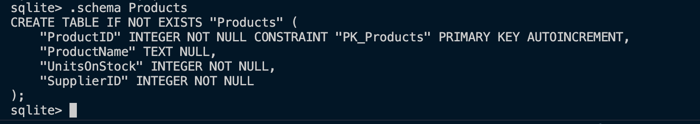

### Podpunkt b

Program pokazujący działanie relacji klasy Supplier z klasą Product.

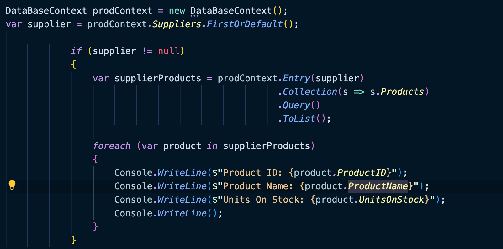

Wynik tego programu.

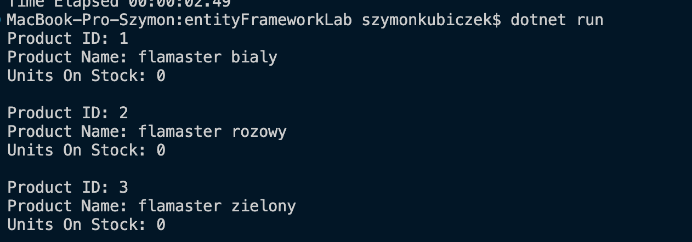

#### Wyżej wymienione klasy

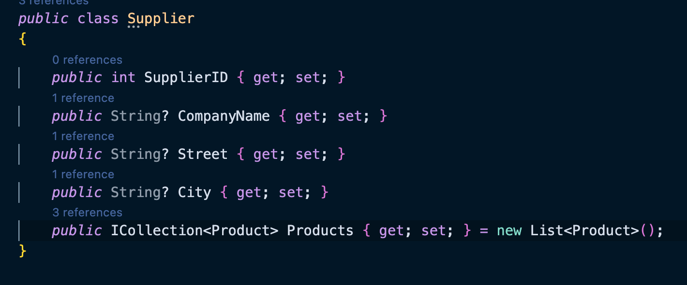

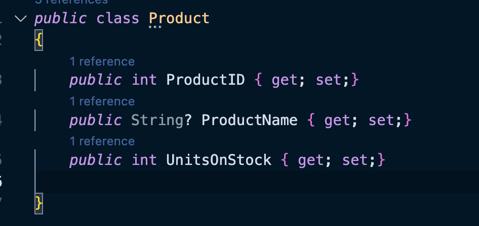

### Podpunkt c

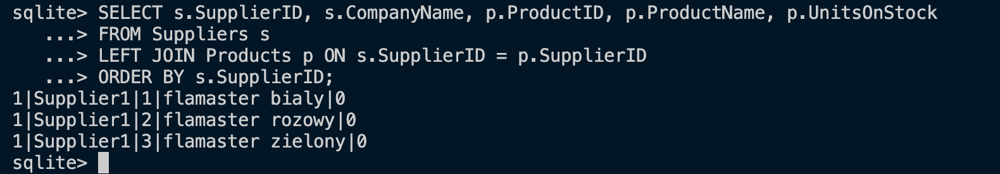

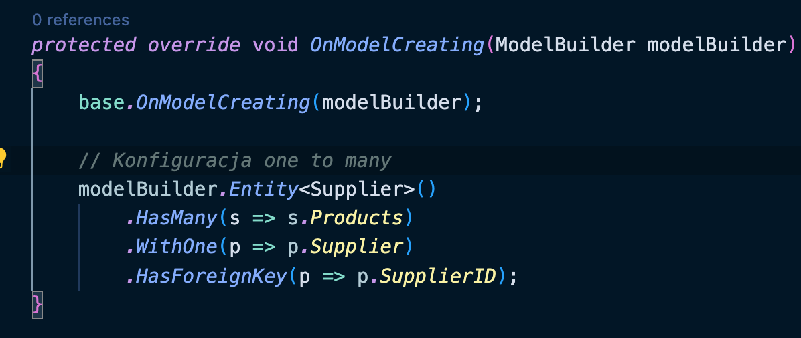

### Podpunkt d

Wyświetlanie produktów należących do poszczególnej faktury.

Dzieje się to za pośrednictwem tabeli pośredniej którą Entity Framework tworzy samo.

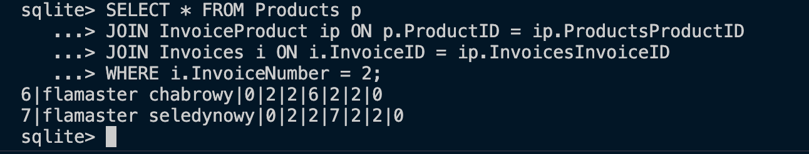

Wyświetlenie faktur do których należy dany produkt.

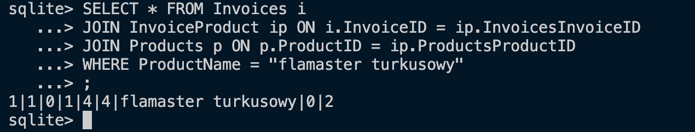

### Podpunkt e

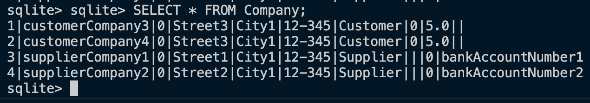

### Podpunkt f

#### Tabela po której dziedziczymy

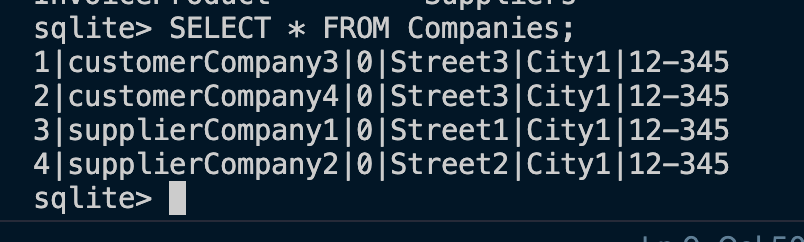

#### Tabele dziedziczące

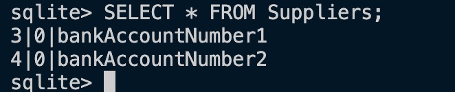

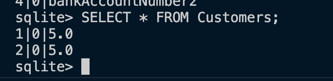

### Podpunkt g

W podpunkcie e została użyta strategia Table=Per-Hierarchy (TPH)
, natomiast w podpunkcie f strategia Table-Per-Type (TPT).

Różnice między strategiami:
- Liczba tabel:
  - TPH: Wymaga jednej tabeli dla całej hierarchii klas.
  - TPT: Wymaga osobnej tabeli dla każdej klasy w hierarchii.
- Złożoność relacji:
  - TPH: Mniej relacji między tabelami, co upraszcza zapytania.
  - TPT: Więcej relacji między tabelami, co może skomplikować zapytania.
- Kolumny z wartościami null:
  - TPH: Posiada wiele kolumn z wartościami null, co prowadzi do marnowania przestrzeni.
  - TPT: Nie ma problemu z wartościami null, ponieważ każda tabela przechowuje tylko dane specyficzne dla swojej klasy.
- Tworzenie nowych tabel:
  - TPH: Rozbudowa hierarchii wymaga modyfikacji wszystkich danych w hierarchii.
  - TPT: Tworzenie nowej tabeli nie wpływa na dane w istniejących tabelach.
- Skalowalność:
  - TPH: Przy dużej liczbie dziedziczących tabel schemat może stać się bardzo skomplikowany.
  - TPT: Każda nowa klasa dodaje nową tabelę, co ułatwia rozbudowę i zarządzanie schematem.
