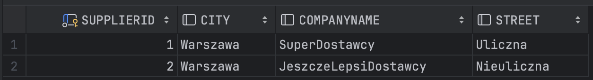

# Hibernate - raport

W zespole:
- Bartłomiej Szubiak,
- Szymon Kubiczek,
- Konrad Armatys

## Część I

## Część II

### Podpunkt I

#### Klasy Product i Supplier

#### Kod dodający dane oraz mapping klas

#### Zawartość tabeli Product

#### Zawartość tabeli Supplier

### Podpunkt II (wersja z tabelą łącznikową)

#### Klasy Product i Supplier

#### Kod dodający dane

#### Zawartość tabeli Product

#### Zawartość tabeli Supplier

#### Zawartość tabeli łącznikowej Supplier_Product

### Podpunkt II (wersja bez tabeli łącznikowej)

(kod dodający dane pozostał ten sam)

#### Klasy Supplier i Product

#### Przykładowe zapytanie pokazujące produkty dla dostawcy z id=1

### Podpunkt III

#### Klasy Supplier i Product

#### Kod dodający dane

#### Logi z hibernate pokazujące obecność obustronnej relacji one to many
